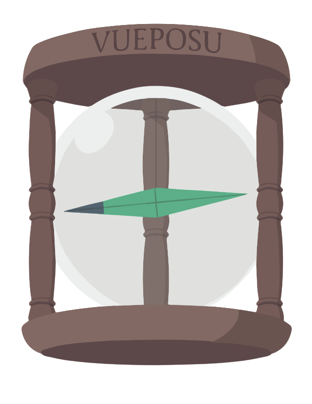

# Introduction

## What is vueposu?

`vueposu` is a hooks library based on `Vue Composition-API`. 

So before start, you need to know the basic usage of [Vue](https://v3.vuejs.org/) and [Vue Composition-API](https://composition-api.vuejs.org/).

 

## The name means:

> 🧭 &nbsp;&nbsp;Vue's Eternal Pose (永久指针, 永久指針エターナルポース, Etānaru Pōsu) 

—— From [One Piece](https://onepiece.fandom.com/wiki/Eternal_Pose). <!-- (https://en.wikipedia.org/wiki/One_Piece#cite_note-EPose-29) -->

 

## Thanks

In no particular order, vueposu is inspired by these great awesome works:

- [react-use](https://github.com/streamich/react-use)
- [vueuse](https://github.com/antfu/vueuse)
- [vue-composable](https://github.com/pikax/vue-composable)
- [vercel/swr](https://github.com/vercel/swr)
- [ahooks](https://github.com/alibaba/hooks)

 

## MIT

The MIT License.